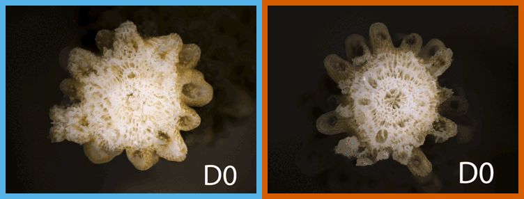

# LTH: Long-Term Heating × Wounding × Gene Expression in *Acropora pulchra*

> Project #17 · Gump Station, Mo'orea, French Polynesia · May–July 2025 · Repo: `stier-lab/17.-LTH_expression_by_temperature_2025` · Updated 2026-07-02

<p align="center">
  <br>
  <sub><b>Wound healing over 15 days.</b> <b>Ambient&nbsp;28&nbsp;°C</b> (left, blue) closes the wound <b>and</b> regrows the tip;
  <b>Heated&nbsp;31&nbsp;°C</b> (right, orange) closes the wound but never regenerates.</sub>
</p>

A heat × wounding experiment on the branching coral *A. pulchra*: we clipped the growing tip off half the fragments, held corals at **28 °C** or **31 °C (+3 °C)**, and tracked healing, growth, physiology, and symbionts for 15 days, plus tissue for gene expression (RNA-seq).

**The phenotype result:** heat doesn't slow recovery uniformly — corals seal the wound (healing) at the same rate hot or not, but heated corals fail to rebuild skeleton at the tip (regeneration). Heat breaks one phase, not the other. (The paper's lead result is the transcriptomic mechanism; RNA-seq pending. The Intro/Discussion/Abstract and the RNA-seq pipeline are out of scope for this repo.)

**More detail:** full results → `RESULTS.md` · figures → `figures/FIGURE_INDEX.md` · data → `data/DATA_DICTIONARY.md` · RNA-seq notes → `docs/rnaseq/`.

## Quick start

```bash
cd ~/Stier-LTH-expression-by-temperature-2025
Rscript -e 'install.packages(c("tidyverse","here","readxl","janitor","scales","patchwork","lme4","lmerTest","blme","nlme","MuMIn","car","emmeans","DHARMa","broom","broom.mixed","influence.ME","lmtest","survival","survminer","xml2"))'
Rscript code/_run_all.R          # full pipeline (~4 min); rebuilds every figure + table
```

Requires R ≥ 4.3. Everything regenerates from `code/_run_all.R`; **never hand-edit numbers** — every statistic lives in `output/tables/20_master_results.csv`, and `code/30_manuscript_audit.R` warns if the manuscript drifts from it.

## Design

| Factor | Levels |
|---|---|
| **Temperature** | 28 °C (ambient) vs 31 °C (heated). Ramped 1 °C/day. |
| **Wound** | Wounded (~1 cm clipped off growing tip) vs unwounded sham. Applied 7 days after reaching target temp. |
| **Genotype (thicket)** | A, C, D — fixed effect (only 3 field genets). |
| **Tank** | 8 total, 4 per temperature (28 °C: 3, 6, 9, 12; 31 °C: 4, 5, 10, 11). Random effect. |
| **Time** | Daily obs; destructive biopsies D0, D1, D3, D10, D15. |

**n = 208 fragments** (192 gene-expression + destructive physiology; 48 also tracked non-destructively; 16 for microscope photography). **Site:** Mahana / Tiahura, NW Mo'orea — thickets A (17.49735 °S / 149.91557 °W), C (17.49808 / 149.91595), D (17.49726 / 149.91581), the same reef as Cunning et al. 2024's CBASS genets.

## Key findings (phenotype half)

Organismal context, not the paper's lead result. Numbers trace to `output/tables/20_master_results.csv`; full narrative + caveats in `RESULTS.md`; summary figure `figures/16_manuscript_fig1.pdf`.

1. **Heat broadly compromises physiology.** At 31 °C, photochemistry, pigment, symbionts, and growth all decline while 28 °C holds. By Day 14 heated corals paled (58–67 % vs 0–8 %) and grew **34 % less** (6.10 → 4.03 % skeletal mass change).
2. **Heat blocks regeneration, not healing** — the headline. Wounds seal equally, but new corallites form in 100 % of ambient vs 33 % of heated corals; 67 % of heated corals heal but never rebuild skeleton (interval-censored Weibull time ratio 1.32, 95 % CI 1.19–1.47, p = 1.4e-7; Cox HR 0.22). See `figures/14_morphology_KM.pdf`.
3. **Genotype matters: C > D > A.** Genet C defends its physiology and regenerates best; its multivariate state shifts **3.6× less** under heat than A's (PCA displacement 1.02 vs 3.71). See `figures/19_genet_dashboard.pdf`.
4. **Chronic-sublethal, not acute.** 31 °C sits **~4.4 °C below** the acute CBASS Fv/Fm ED50 (35.4 °C; Cunning et al. 2024) — weeks of sub-bleaching stress, not acute photoinhibition. See `figures/26_thermal_context.pdf`.

**Stats in brief:** per-response linear mixed models (`response ~ treatment × wound × day × thicket + (1|tank) + (1|id)`, type-III); binomial GLMMs (penalized where separation occurs) for the 8 binary healing traits; interval-censored Weibull AFT (+ Kaplan–Meier / Cox) for recovery milestones; PCA for the multivariate summary; DHARMa diagnostics throughout. Genet is a fixed effect (only 3 levels). Growth = % skeletal mass change (no areal calcification — surface area unmeasured). Full methods in `RESULTS.md`.

## Repository map

| Path | Contents |
|---|---|
| `code/` | Analysis scripts; run order = file number, driven by `code/_run_all.R`. Each has a Purpose/Input/Output header. `sensitivity/` and `diagnostics/` hold robustness and model-diagnostic suites. |
| `data/raw/` | Exported from Drive — never hand-edited. Decoded in `data/DATA_DICTIONARY.md`. |
| `data/processed/` | Cleaned `.rds` the pipeline produces (regenerable). |
| `data/external/` | Cunning et al. 2024 CBASS ED50 reference. |
| `output/tables/` | Every result as CSV; `20_master_results.csv` is the single source of truth. |
| `output/` | Also `models/` (fitted `.rds`) and `diagnostics/` (regenerated reports). |
| `figures/` | All figures (`.pdf` + `.png`); catalogued in `figures/FIGURE_INDEX.md`. |
| `literature/` | 101 PDFs + `LITERATURE.md` (bibliography + synthesis). |
| `manuscript/Manuscript_LTH.md` | Working draft — phenotype Methods + Results. |
| `docs/rnaseq/` | RNA-seq design, analysis proposal, genet-matching, candidate genes (suggestions, not a prescribed pipeline). |
| `docs/team_summary/` | Shareable results summary (`.Rmd` + HTML) and pulled deck imagery. |
| `RESULTS.md` | Full results narrative (all responses, genet effects, thermal context, §10 limitations). |
| `notes/` | Sequencing plan; `notes/archive/` field notes and superseded plans. |

## Data & Drive

Raw data is exported **from** Google Drive (the project of record: raw Sheets, field notes, manuscript Doc); the repo never writes back. Drive folder `17. LTH_expression_by_temperature_2025` (ID `1sXfnHN-vmSBuwMEfERiYOWDeKRmjFWJP`), reached via the `gws` CLI. When Drive data changes, re-export into `data/raw/` and re-run the pipeline. Photographs live on the Stier Lab NAS (`smb://stier-nas1.eemb.ucsb.edu`); RNA-seq reads are processed at UC Davis (NCBI BioProject TBD).

## RNA-seq (next)

144 libraries shipped to UC Davis; counts will land in `data/raw/sequencing/`. The per-library phenotype covariate table is already built (`output/tables/31_rnaseq_phenotype_covariates.csv`, joined by `Fragment_ID`). Design notes, the genet-matching plan (call SNPs from host reads → match A/C/D to Cunning's genets), and candidate genes are in `docs/rnaseq/`.

## License and funding

**License:** Code MIT · Data CC-BY 4.0 (until publication, then DOI) · Manuscript all rights reserved.
**Funding:** NSF support to the project investigators. Field work at the UC Berkeley Gump Research Station, Mo'orea, French Polynesia.
