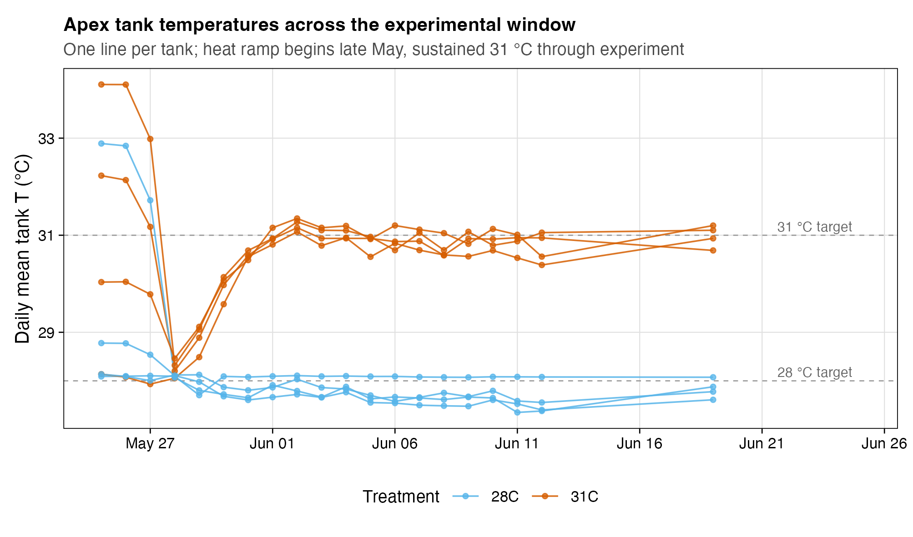
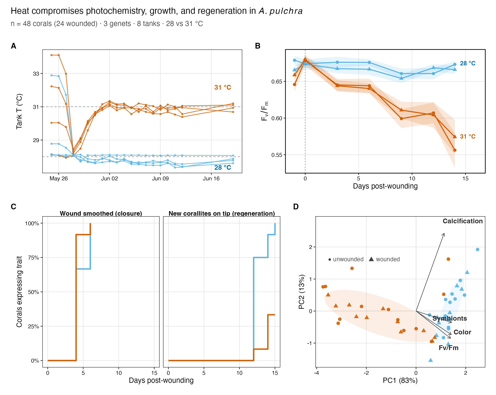
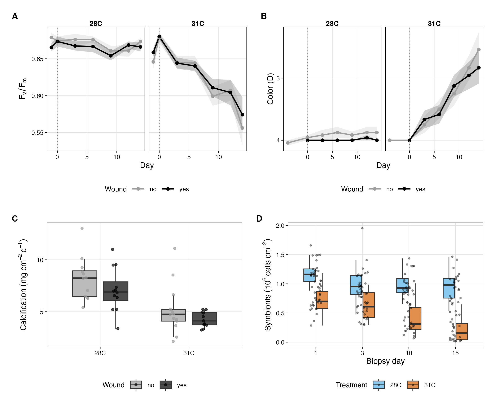
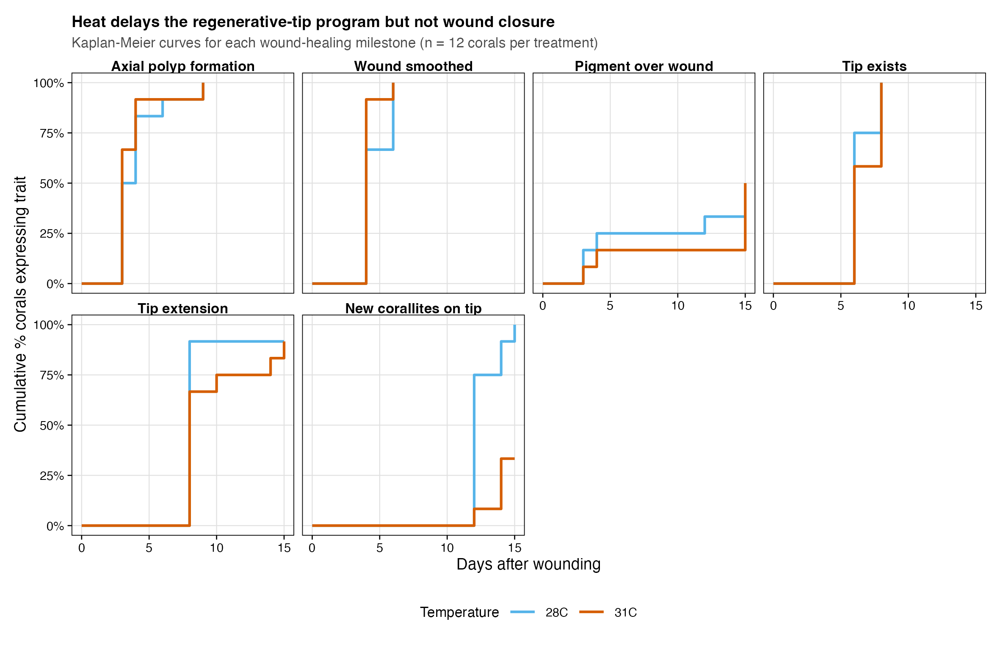
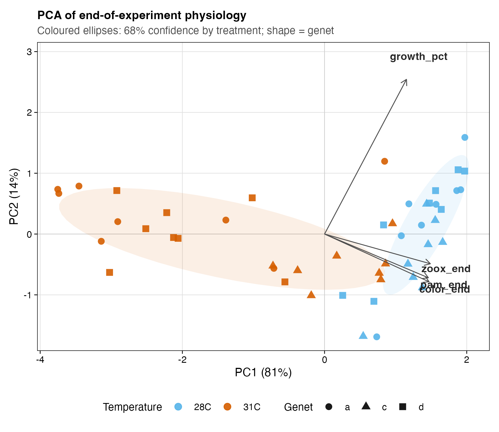
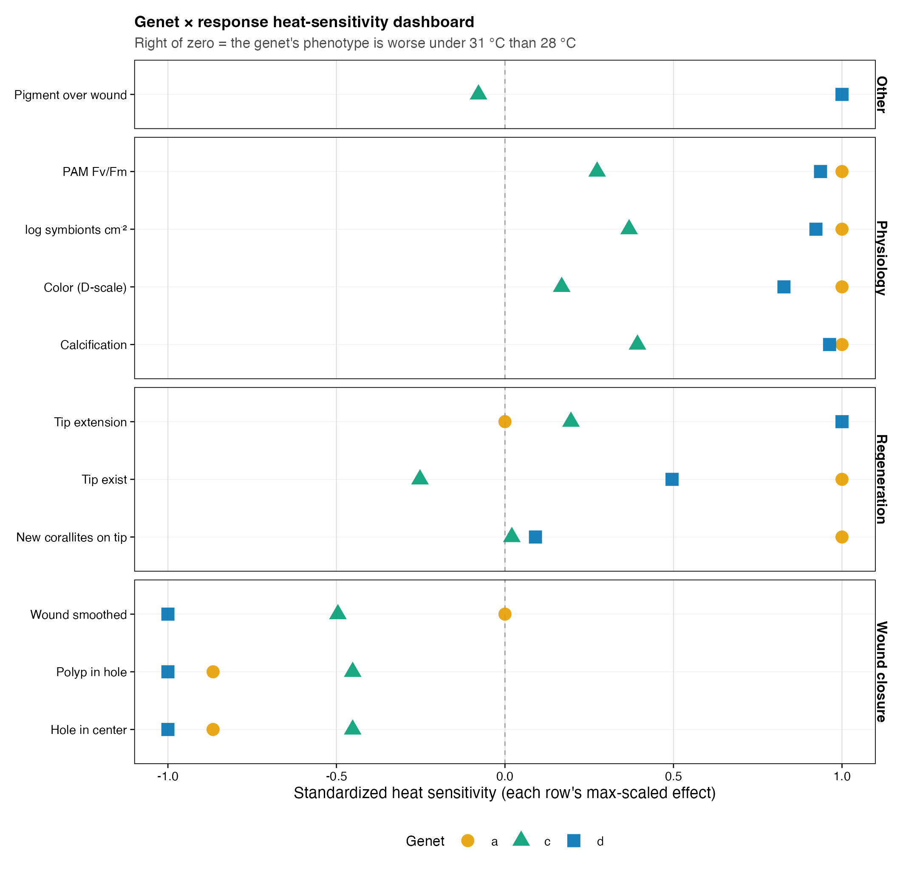
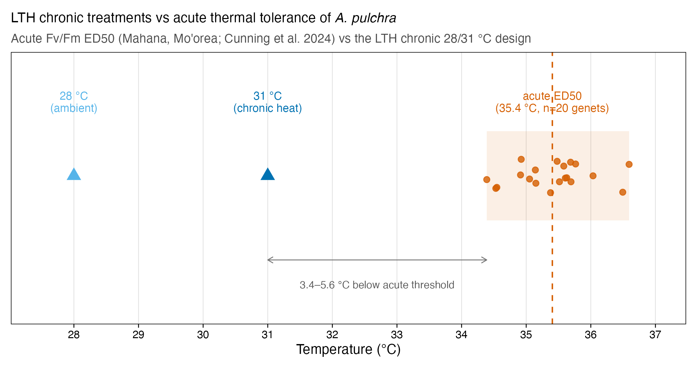

# LTH phenotype analysis — visual summary

> 🗂️ **Plain-language analysis walkthrough** · Updated 2026-06-12 · Index: [`DOCS_INDEX.md`](../DOCS_INDEX.md) · figures from `figures/`; numbers → `output/tables/20_master_results.csv`.

*A first-read overview of what we found and how we asked each question. Plain-language stats
included — no prior knowledge of this project assumed. Every number here traces to
`output/tables/20_master_results.csv`; the full narrative is in `RESULTS.md`.*

> **Scope:** this is the **phenotype** half of the study (physiology, morphology, growth, genotype
> variation) — the part the Stier lab finished. The **gene-expression** analysis is Shreya's lead
> contribution and isn't covered here. Where the two connect:
> `docs/for_shreya/gene_expression_integration_map.md`.

---

## The question

Branching corals like *Acropora pulchra* get injured constantly (breakage, corallivory,
fragmentation) and must **heal** the wound and **regrow** lost skeleton to persist. Warming oceans
force them to do this while also fighting heat stress. We asked: **does heat impair coral recovery,
and if so, where — does it slow the whole repair program, or hit one specific phase? And does that
vulnerability depend on genotype?**

## The design (how the experiment was built)

We crossed **temperature** (28 °C ambient vs 31 °C heated, +3 °C) with **wounding** (clip the
growing tip vs unwounded sham), using **three field-collected genets** (parent colonies A, C, D)
from Mahana, Mo'orea, across **8 tanks** (4 per temperature). Corals were held at temperature for 7
days, wounded on Day 0, and tracked for **15 days**. We measured photochemistry (PAM *Fv/Fm*),
pigmentation (color card), symbiont density, calcification (buoyant weight), and a 9-trait
morphological scoring of wound recovery.

*Treatment validation: tanks held within ~0.3 °C of their 28 °C / 31 °C setpoints across the
experiment.*

**The phenotype summary figure** (the phenotype results below, in one place):

*The paper's headline is the transcriptomic mechanism (S. Banerjee, lead author; analysis pending).
This figure and everything in this document are the organismal **context** for that mechanism, not
the paper's lead result.*

---

## Take-home 1 — Sustained heat compromises whole-colony physiology

At 31 °C, photochemical efficiency, pigmentation, symbiont density, and calcification all declined
progressively; at 28 °C they held steady. By Day 14, heated corals had lost photochemical
efficiency, paled (**67 %** of heated wounded corals vs **0–8 %** of ambient), lost symbionts, and
calcified **38 % less** (7.62 → 4.75 mg CaCO₃ cm⁻² d⁻¹).

**How we asked it, statistically.** For each continuous response we fit a **linear mixed model** —
`response ~ temperature × wound × day × genet`, with tank and individual coral as **random effects**
(they account for non-independence: repeated measures on the same coral, corals sharing a tank). The
heat signal lives in the **temperature × day interaction** (the *rate* of divergence over time),
because with day measured from wounding the main effects are evaluated before heat has acted. All
four interactions were highly significant (e.g. *Fv/Fm* F = 106.6; color F = 239.3; symbionts
F = 94.0; all *p* < 0.001), using type-III ANOVA. *Plain version: a mixed model lets us ask "do
heated and ambient corals drift apart over time?" while correctly handling the fact that we measured
the same corals and tanks repeatedly.*

---

## Take-home 2 — Heat blocks **regeneration**, not **healing** (the key phenotype result)

Recovery has two phases: **tissue healing** (the coenosarc seals the wound) and **regeneration**
(new skeleton/corallites rebuild at the tip). **Heat spared the first and arrested the second.**
Wounds *closed* at the same rate in both temperatures, but new corallites formed in **100 % of
ambient** wounded corals vs only **33 % of heated** ones. The clearest per-coral version: at 28 °C
every coral that healed went on to regenerate; at 31 °C **67 % healed but never rebuilt skeleton**.

**How we asked it, statistically.** Each binary recovery trait (e.g. "wound smoothed", "new
corallites present") was turned into a **time-to-event** interval: the previous scored day and the
first scored day when a coral reached that milestone. The primary timing test is an
**interval-censored Weibull AFT model**; Kaplan-Meier and Cox curves are retained as first-observed-day
summaries. New-corallite regeneration: **time ratio = 1.32 (95 % CI 1.19–1.47, *p* = 1.4e-7)** —
heated corals reached it later or not within the experiment. *Plain version: survival analysis is the
right tool because many corals never reach the
milestone in 15 days ("censored") — it uses both the timing and the never-happened information,
which a simple percentage throws away.*

---

## Take-home 3 — Genotype matters: a heritable resilience gradient (C > D > A)

The three genets responded very differently to heat. **Genet C consistently defended** its
physiology and was the most likely to regenerate under heat; **A and D were sensitive.** In
multivariate physiology space, genet C's state shifted **3.5× less** under heat than genet A's
(centroid displacement 1.06 vs 3.72).

**How we asked it, statistically.** With only **3 genets**, we treated genet as a **fixed effect**
(too few levels to estimate as random) and tested whether the heat response differed by genet via
**likelihood-ratio tests** on the genet × temperature interaction (significant for *Fv/Fm*, color,
symbionts: χ² = 90.5, 177.7, 73.6; all *p* < 0.001). We summarized each genet's overall heat
sensitivity two independent ways — a **composite standardized sensitivity** across 11 responses
(A = +0.43, D = +0.29, C = −0.03) and the **PCA centroid displacement** above — which agree.

---

## Take-home 4 — This is **chronic-sublethal** stress, not acute bleaching

We benchmarked our 31 °C treatment against an independent, calibrated **acute** heat-tolerance assay
for the *same species and reef* (Cunning et al. 2024 CBASS *Fv/Fm* ED50). The mean acute ED50 is
**35.4 °C**, so our 31 °C sits **~4.4 °C below** the acute photochemical threshold. The declines we
see are therefore *accumulated, sub-bleaching* stress over weeks — the realistic regime for the
recurrent, moderate warming reefs increasingly face — not acute photoinhibition.

**How we asked it, statistically.** This is a *placement*, not a new test: we plotted our two
treatment temperatures against the distribution of acute ED50s across 20 genotyped genets from the
same population, and noted that both methods independently detect genotype-level tolerance variation
(acute ED50 range 2.2 °C; our chronic ranking C > D > A).

---

## How to read the statistics (quick glossary)

| Term | What it means here |
|---|---|
| **Linear mixed model (LMM)** | Regression for the continuous responses that accounts for repeated measures (same coral over time) and grouping (corals in tanks) via random effects. |
| **treatment × day interaction** | The *rate* at which heated and ambient corals diverge — this is the heat signal, not the day-0 main effect. |
| **Interval survival / Kaplan–Meier / Cox** | Survival analysis for "time until a recovery milestone." Interval models handle discrete scoring days; KM/Cox summarize first observed onset. |
| **genet as a fixed effect** | With only 3 genets, we estimate each one's effect directly rather than as a variance component (more reliable with so few groups). |
| **type-III ANOVA** | Tests each term adjusting for all others (the correct default for interaction models). |
| **confirmatory vs exploratory** | A-priori predictions (grounded in the literature) are reported unadjusted; exploratory tests are multiple-comparison corrected (`code/28`). |

## Honest caveats (worth knowing on a first read)

- **The regeneration result is real but concentrated:** the strongest timing signal is
  new-corallite onset in the interval-censored model (*p* = 1.4e-7); tip-exist is also delayed
  (*p* = 0.036), while tip-extension remains non-significant. The censored fraction (67 % vs 0 %) and
  the per-coral lag are the strongest framing. (`RESULTS.md` §10.)
- **Three genets** is enough to detect genotype variation but not its genetic architecture — that's
  what the forthcoming gene-expression + SNP work resolves.
- **Chlorophyll-a was not run**, and the apical-tip wound assay isn't identical to a surface
  wound bed — so the phase-decoupling should be retested across wound geometries.

## Where to go next

- Full numbers: `output/tables/20_master_results.csv` · narrative: `RESULTS.md`
- Every figure catalogued: `figures/FIGURE_INDEX.md`
- How this connects to the gene-expression work: `docs/for_shreya/gene_expression_integration_map.md`
- Reproduce everything: `Rscript code/_run_all.R` (see `START_HERE.md`)
